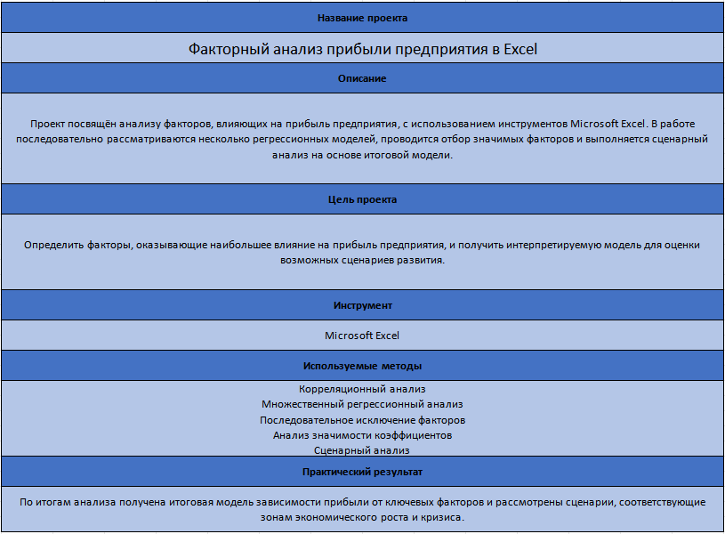
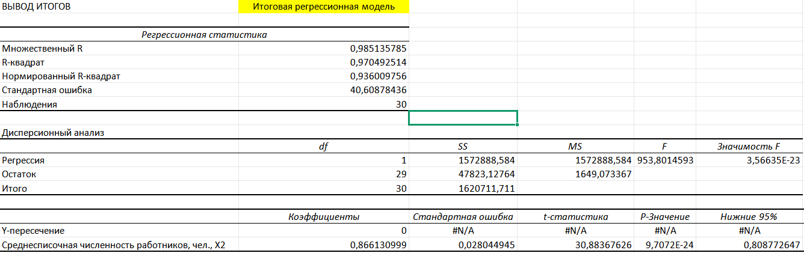
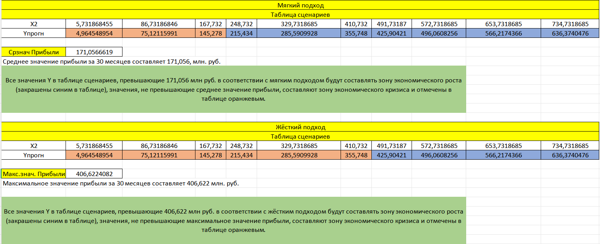

# Excel_profit_factor_analysis

Аналитический проект в Microsoft Excel, посвящённый исследованию факторов, влияющих на прибыль предприятия.  
В работе последовательно рассматриваются несколько регрессионных моделей, выполняется отбор значимых факторов методом последовательного исключения, а затем проводится сценарный анализ на основе итоговой модели.

## О проекте

Цель проекта - определить факторы, оказывающие наибольшее влияние на прибыль предприятия, и получить интерпретируемую модель для оценки возможных сценариев развития.

В рамках проекта:  
подготовлены и структурированы данные для анализа  
рассмотрены несколько регрессионных моделей с различными наборами факторов  
выполнено последовательное исключение статистически незначимых факторов  
построена итоговая регрессионная модель  
проведён сценарный анализ для интерпретации зон экономического роста и кризиса  
сформулированы итоговые выводы по результатам анализа  

## Инструменты

Microsoft Excel  

## Используемые методы

Корреляционный анализ  
Множественный регрессионный анализ  
Последовательное исключение факторов  
Анализ значимости коэффициентов  
Сценарный анализ  

## Результат

По итогам анализа была получена итоговая модель зависимости прибыли предприятия от ключевых факторов и рассмотрены сценарии, соответствующие зонам экономического роста и кризиса.

## Структура проекта

    Excel_profit_factor_analysis/
    ├── Факторный_анализ_прибыли.xlsx
    ├── README.md
    └── screenshots/
        ├── overview.PNG
        ├── final_model.PNG
        └── scenario_analysis.PNG

---

## Содержимое Excel-файла

В Excel-файле представлены:  
Лист с общей информацией о проекте;  
Лист с постановкой задачи;  
Последовательные этапы анализа данных;  
Промежуточные и итоговые результаты регрессионного анализа;  
Сценарный анализ;  
Итоговые выводы.  

---

## Скриншоты

### Описание проекта

### Итоговая регрессионная модель

### Сценарный анализ

---

## Ключевая идея проекта

Проект показывает, как с помощью Excel можно не только выполнить расчёты, но и оформить полноценный аналитический кейс: от подготовки данных и отбора факторов до интерпретации итоговой модели и оценки возможных сценариев развития предприятия.

---

## Автор

**Максим Беленький**  
Студент направления «Прикладная информатика», специализация «Большие и открытые данные».  

GitHub: [squirell23](https://github.com/squirell23)
